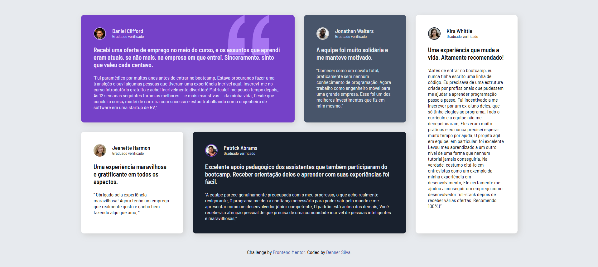

# Frontend Mentor - Solução para a seção de quatro cartões

Esta é uma solução para o [desafio de testemunhos-grade-seção](https://www.frontendmentor.io/challenges/four-card-feature-section-weK1eFYK).

## Visão geral

### O desafio

Desafio concluído! Design responsivo e adaptável para mobile.
Bem estruturado e organizado.

### Captura de tela

### Links

- URL da solução: [GitHub](https://github.com/Denner-94/testemunhos-grade-secao)
- URL do site ao vivo: [testemunhos-grade-secao](https://denner-94.github.io/testemunhos-grade-secao/)

## Meu processo

### Construído com

- Marcação HTML5 semântica
- Propriedades personalizadas CSS
- Flexbox
- CSS Grid
- Fluxo de trabalho mobile-first

### O que aprendi

Coloquei em prática a combinação do Flex Box com Grid Layout.

### Desenvolvimento contínuo

Continuar praticando o Grid Layout

## Autor

- Instagram - [Denner Silva](https://www.instagram.com/denner_souza.s/)